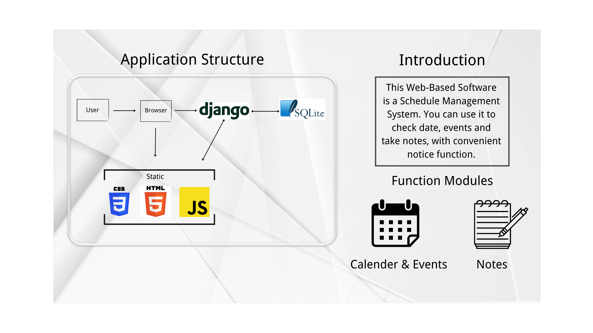

# INTRODUCTION TO OUR PROJECT

## ESSENTIAL PART

### GRAPHIC ABSTRACTION

### PURPOSES

- #### Process type

  - This application applied **Agile** development process.

- #### Why we choose Agile

  - This calendar is a small volume software and a kind of *schedule management software* for a wide market and we need to produce it as soon as possible.
  - At the same time, during the developing process, we may *change the requirements resiliently*. It's not appropriate to use water-fall process which is inflexible.
  - Nowadays, most softwares are developed using Agile process, we follow the popularity.
  - We don't have too much regulations of the software, except some fixed requirements we decide our developing policies according to the current developing process. So Agile process is a better option for us.

- #### Possible usage

  - For *students and teachers* to record the date to have an exam, the particular date to submit their homeworks and so on.  
  - For *company staffs* to mark the events on the date using it to help them make better contribution to their company.   
  - For *any people* who may use the calender to record the events in their daily life. 
  

### SOFTWARE DEVELOPMENT PLAN

- #### Development Process
  - For **requirement engineering** phase:
    - Before we started this project, we used the Internet to do some research on the types of software people currently use. We found that young people use entertainment software more often, while middle-aged and elderly people use office software or simple chat software more often. As for schedule management software, it is often used by people of all ages, so the *market demand is relatively stable* and many electronic manufacturers have set it as one of the most essential software for electronic products. The market demand for schedule management software is not only stable but also includes many functions. It usually includes calendars, notebooks, weather forecasts and other related functions. The software we designed this time is a *multi-functional schedule management software* that integrates *calendar and notebook functions*. Regarding requirement engineering, since this software is a *front-end software* and is used by the public.The requirements are diverse and change frequently, so we use the agile software process model to quickly meet consumer requirements, such as adding note taking function, adding camera functions, recording functions, etc.
  - For **software design and implementation** phases:
    - For **define the context and modes** of use of the schedule management software:
      1. Identify the Users: We determine the primary users of the system. This may include *individuals, teams or organizations* that need to manage their schedules and tasks. Consider their roles, responsibilities, and specific requirements when it comes to scheduling and time management.
      2. Understand User Goals and Needs: Identify the goals and needs of the users within the context of schedule management. For example, individual users may want to add tasks, delete tasks,track deadlines and improve productivity. Teams may focus on coordinating schedules, assigning tasks, and collaborating on projects. We gather and understand these goals to help us to shape our system's features and functionalities.
      3. Consider Usage Scenarios(use cases): Create scenarios or use cases that depict how users will interact with the schedule system in different situations. For example, scenarios could include a user adding a *new event, rescheduling a task*.These scenarios help define the context and modes of use for various user interactions and to ensure whether the functions of the software can be implemented normally in real-life situations.
      4. Determine Contextual Factors: Consider the contextual factors that may influence the usage of the schedule system. This includes factors such as the *physical environment* (e.g.office, remote), *device types* (e.g.desktop, mobile) and any specific constraints or requirements related to scheduling and time management.
    - For **define the system architecture**:
      1. Identify System Components: Break down the software into logical components (subsystem)that will work together to fulfill the functional requirements. Common components for our schedule software can include a *user interface*,task management module, calendar integration module,reporting module and a data storage component.* 
      2. Choose Architectural Patterns: for our schedule, we choose the layered architecture which organizes the system into multiple layers, with each layer responsible for a specific set of tasks. In the context of our schedule software, the layers can include *a presentation layer for the user interface*, *a business logic layer for task management* and *a data layer for data storage and retrieval*.
    - For **the principal system objects** in schedule software：
      1. Task/Event(core entities that users create, update and delete within the schedule software);
      2. Calendar;
      3. User;
      4. Notification;
    - For **develop design models**:
      1. Sequence Diagrams: We draw this diagram to illustrate the interactions and message exchanges between objects over time which can capture the sequence of events when a user creates a task, updates a task, or delete a task.
      2. Component Diagrams: We draw it to clearly show the components of the system and their relationships.For example, represent components such as User Interface, Task Manager, Calendar Integration and so on.
    - For **specify object interfaces**:
      1. TaskInterface: This interface can define methods such as createTask(), updateTask(), deleteTask(), and getTaskDetails(). Any object that implements this interface would need to provide implementations for these methods, ensuring consistent behavior across different task-related objects.
      2. CalendarInterface: This interface might include methods like addEvent(), removeEvent(), getEvents(), and setEventReminder(). Objects that implement this interface would be responsible for managing *calendar-related functionalities* and would need to provide these methods.
      3. UserInterface: This interface can define methods for user-related operations, such as createUser(), authenticateUser(), getUserDetails(), and updateUserSettings(). Objects implementing this interface would handle *user management and authentication tasks*.
      4. NotificationInterface: This interface can give a reminder for the user to complete their tasks on time.
  - For **software testing**:
    - Acceptance testing: it is to verify that the software functions as expected in real-world scenarios and meets the defined acceptance criteria.
    - Functional Testing: Test cases are designed to cover different functionalities, such as creating tasks, managing calendars and so on.
    - Usability Testing: We focus on evaluating the user-friendliness, intuitiveness, and overall user experience of the schedule software. 
    - Security Testing: This type of testing aim to identify vulnerabilities and weaknesses in the schedule software's security controls. It involves assessing authentication mechanisms, data privacy, access controls, and protection against common security threats.
  - For **software evolution/maintenance**:
    - There are three types of maintenance which are *fault repairs* ,*environmental adaptation* and *functionality addition and modification*.
    - For our schedule software **functionality addition and modification** is more important.We have to gather and analyze user feedback, feature requests and evolving business needs to identify new features or modifications to existing functionality that align with the software's goals and objectives.

- #### Members
  - Harry(p2211355):
    - Role: project manager, software designer and software maintainer
    - Responsibility:mainly determine the type of software and corresponding functions, write the source code for each of the function to make sure the software can work well and add relevant functions to the software to maintain its normal operation   
    - Portion:
      1. complete part of source code
      2. complete some parts in the readme file
      3. design the main structure of our software
      4. do the testing for our software
      5. do the maintenance work after the prototype of our software
  - Ethan(p2211414):
    - Role: project manager, software designer and software analyst
    - Responsibility:mainly determine the type of software and corresponding functions, write the source code for each of the function to make sure the software can work well and analyze the rationality and consistency of the use of relevant functions  
    - Portion:
      1. complete the remaining source code
      2. do the testing for our software
      3. design the main structure of the software
      4. analyst the whole software 
      5. improve the function of the software
  - Wendelin(p2211552):
    - Role: project manager, software tester and software analyst
    - Responsibility:mainly determine the type of software and corresponding functions and test whether each of the function can work in diffierent cases then write a document to summary the software. 
    - Portion:
      1. do the testing for our software
      2. design the main structure of the software
      3. analyst the whole software with each of the function
      4. complete remaining parts in the readme file
- #### Schedule
  - Project Planning: such as requirements gathering, design, development, testing, deployment, and maintenance.
  - Task Breakdown and completeness: coding a module, writing documentation, conducting testing, or integrating components.
  - Risk Management(maintenance)
- #### Algorithm
  -  Task Dependency Scheduling: We use this algorithm to handle tasks that have dependencies on each other. It ensures that dependent tasks are scheduled in the correct order, considering the dependencies and ensuring that prerequisites are completed before dependent tasks can begin.
  -  Priority-based Scheduling: We assign priorities to tasks based on their importance or urgency. Tasks with higher priorities are scheduled first, ensuring that critical tasks are completed promptly.

- #### Current status
  - Task and Activity Management: Schedule software allows user to create, manage, and organize tasks and activities. You can set due dates, assign tasks to individuals.
  - Calendar Integration: Our schedule software often integrates with calendar systems to synchronize scheduled activities with our calendars which show clear schedule in user interface.
  - Customization and Personalization: We add some covers in our software which allows users to customize and personalize their schedules according to their preferences. This may include choosing different views (e.g daily, weekly, monthly).
  - Notification function: In the future, we can add notification function in our software so that we can be reminded to submit a report or assignment before the deadline. 
- #### Future plan
  - Integration with Other Tools: Schedule software can integrate with other productivity tools, such as project management software, time tracking tools, or document management systems. These integrations provide a seamless workflow and enhance productivity by connecting related tools and data

## ADDITIONAL PART

### DEMO
https://youtu.be/J4jl96kqq3c?si=_5hBakeiUXCO7lXP

### Environments of the software development and running
- System version: Windows 11
- Python version: python 3.11
- Django version: django 5.0.4
- Database: SQLite 3.45.3
- Other dependencies: HTML5，CSS, Java Script
- Required pakcages: bootstrap 3.3.7, jquery 2.2.3, fullcalendar 3.4.0, Select2 3.5.3

### Declaration (Any open sources, packages which are not developed by you (yourgroup) should be declared clearly)
- https://github.com/RobbieHan/sandboxOA.git
- https://getbootstrap.com/
- https://fullcalendar.io/
- https://jquery.com/
- https://select2.org/
